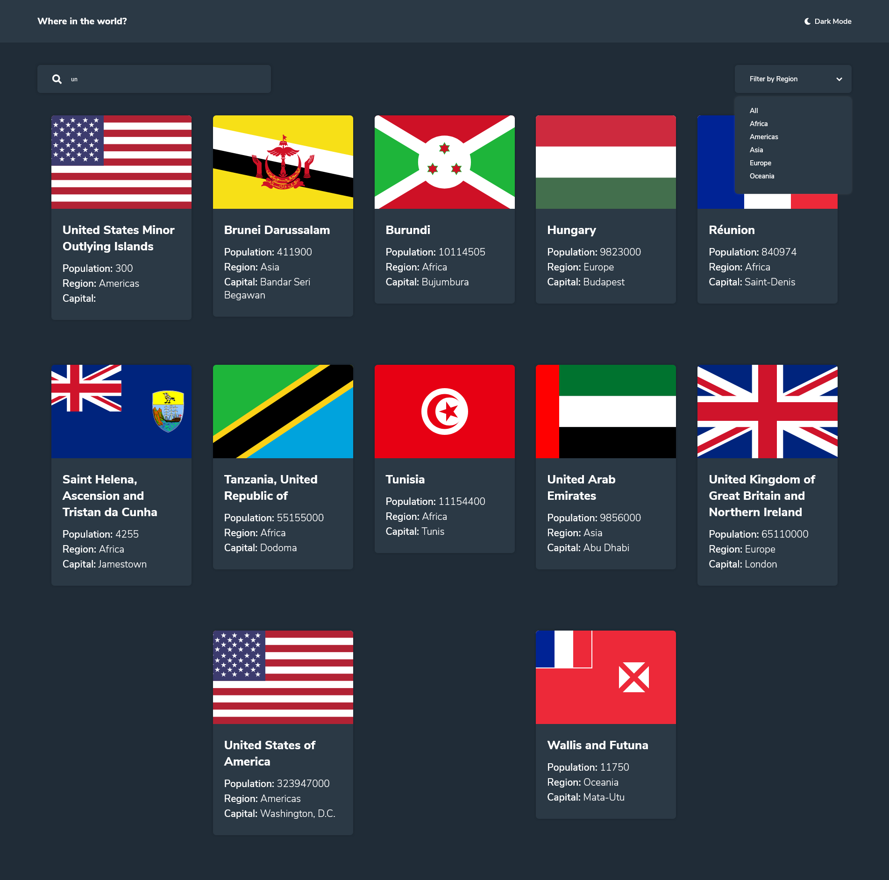
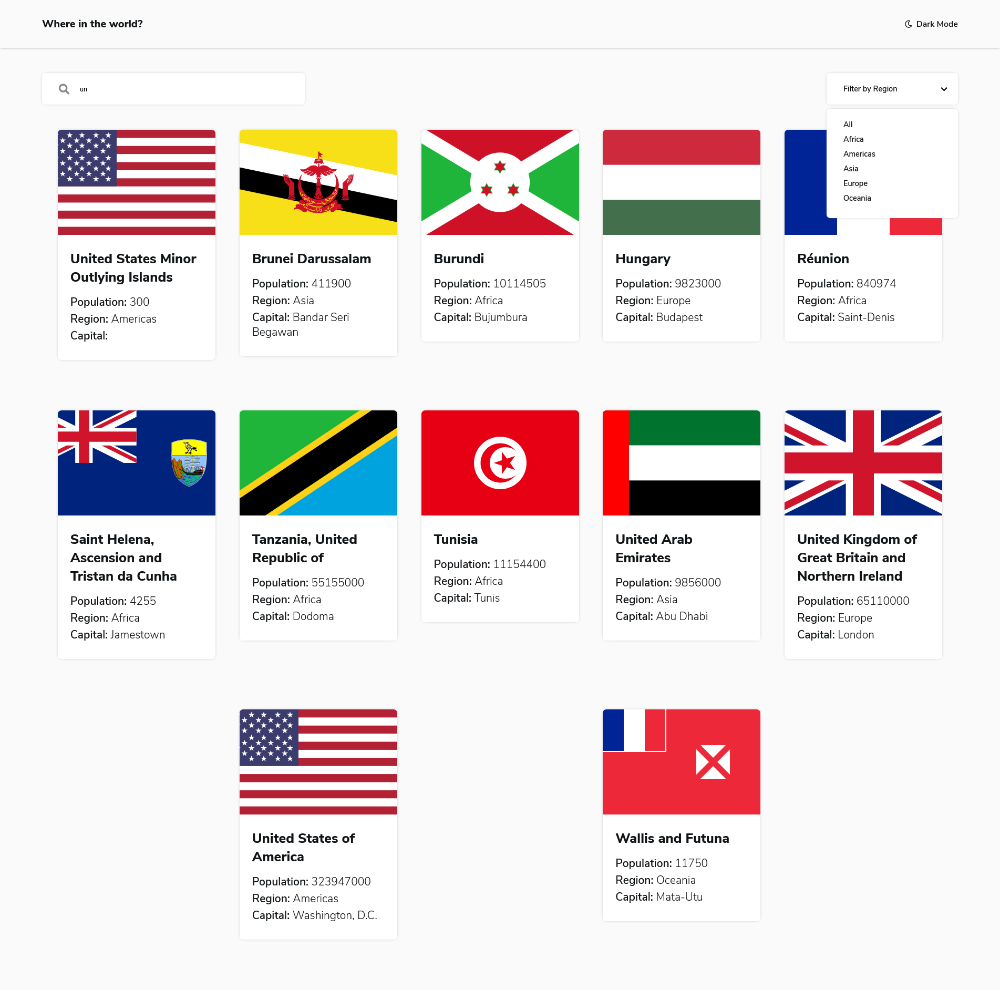
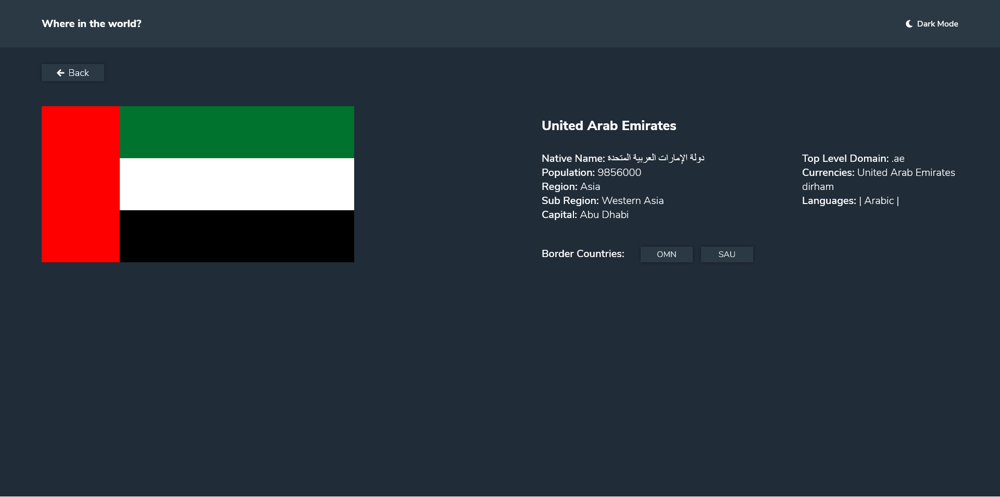
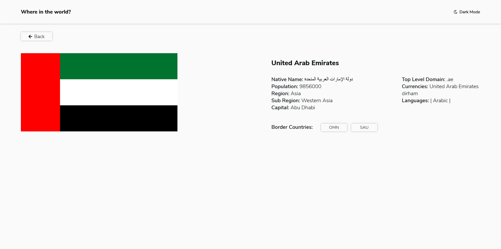
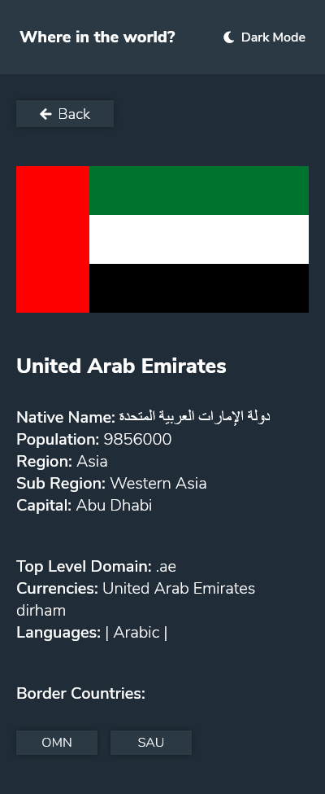
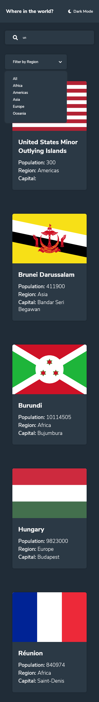
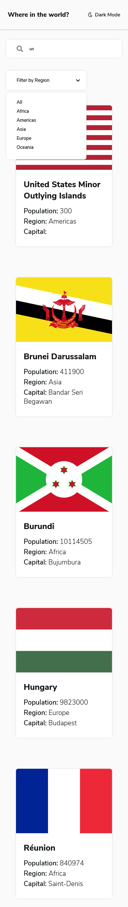

# Frontend Mentor - REST Countries API with color theme switcher solution

This is a solution to the [REST Countries API with color theme switcher challenge on Frontend Mentor](https://www.frontendmentor.io/challenges/rest-countries-api-with-color-theme-switcher-5cacc469fec04111f7b848ca). Frontend Mentor challenges help you improve your coding skills by building realistic projects.

## Table of contents

- [Overview](#overview)
  - [The challenge](#the-challenge)
  - [Screenshot](#screenshot)
  - [Links](#links)
- [My process](#my-process)
  - [Built with](#built-with)
  - [What I learned](#what-i-learned)
  - [Continued development](#continued-development)
  - [Useful resources](#useful-resources)
- [Author](#author)
- [Acknowledgments](#acknowledgments)

## Overview

### The challenge

Your challenge is to integrate with the [REST Countries API](https://restcountries.eu) to pull country data and display it like in the designs.

You can use any JavaScript framework/library on the front-end such as [React](https://reactjs.org) or [Vue](https://vuejs.org). You also have complete control over which packages you use to do things like make HTTP requests or style your project.

Users should be able to:

- See all countries from the API on the homepage
- Search for a country using an `input` field
- Filter countries by region
- Click on a country to see more detailed information on a separate page
- Click through to the border countries on the detail page
- Toggle the color scheme between light and dark mode _(optional)_

### Screenshot










### Links

- Solution URL: [Solution](https://github.com/fidellim/REST-Countries-API-with-Color-Theme-Switcher)
- Live Site URL: [Live Site](https://rest-countries-api-with-color-theme-switcher-fidellim.netlify.app/)

## My process

### Built with

- Semantic HTML5 markup
- SASS
- Flexbox
- Mobile-first workflow
- [React](https://reactjs.org/) - JS library

### What I learned

I was able to practice 7-1 pattern using SASS. It was also my first time tackling Routes, Switches, Params, and other React features. I was also able to practice some conditional rendering.

```scss
@import "abstract/variables";

@import "components/country";
@import "components/button";

@import "base/reset";
@import "base/typography";

@import "layout/header";
@import "layout/countries";
@import "layout/countryDetails";

@import "themes/dark";
```

```javascript
className={isFilterToggled ? "regions openRegions" : "regions"}

<Router>
  <div className={isToggled ? "dark" : null}>
    {/* pass handleToggle func as prop */}
    <Header handleToggle={handleToggle} />
    <Switch>
      <Route exact path="/">
        <Countries />
      </Route>
      <Route path="/:name">
        <CountryDetails />
      </Route>
    </Switch>
  </div>
</Router>
```

### Continued development

To practice more frontend projects using React. I would also like to familiarize myself more on other React features like Switches and Routes.

### Useful resources

- [Routers](https://youtube.com/playlist?list=PL4cUxeGkcC9gZD-Tvwfod2gaISzfRiP9d) - The Net Ninja helped me understand the basic concept of Routers, Switch, and Params.
- [SASS 7-1 Pattern](https://sass-guidelin.es/#architecture) - Helped me organize my SASS files using partials.
- [Box-Shadow Examples](https://www.webfx.com/blog/images/assets/cdn.sixrevisions.com/0457-01-css-box-shadow-demo/demo.html) - Helped me organize my SASS files using partials.
- [Florin Pop Solution](https://youtu.be/uIj8wbvxZIk) - [Sankara Solution Part 1](https://youtu.be/vwZtmHSa9OY) - [Sankara Solution Part 2](https://youtu.be/c9Er4oqgPMM) - The first link is from Florin Pop. Then, the second and third are from Sankara. These solution gave me ideas on how I'll be able to implement this challenge.
- [Avoid Memory Leaks](https://stackoverflow.com/questions/59780268/cleanup-memory-leaks-on-an-unmounted-component-in-react-hooks) - This helped me remove the warning of "avoiding memory leaks".

## Author

- Website - [Fidel Lim](https://fidellim-portfolio.netlify.app/)
- Frontend Mentor - [@fidellim](https://www.frontendmentor.io/profile/fidellim)
- Github - [@fidellim](https://github.com/fidellim)

## Acknowledgments

I would like to thank Florin Pop for giving me ideas for this project. If you are interested in learning from him, have a look at his [Youtube Channel](https://www.youtube.com/channel/UCeU-1X402kT-JlLdAitxSMA). I would also like to thank the Frontend Mentor community for answering any inquries I have.
